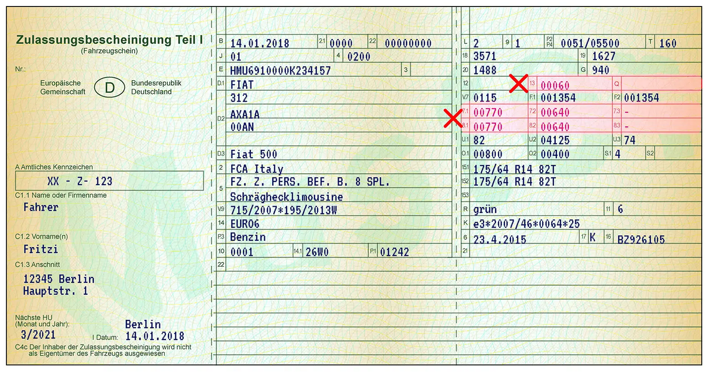
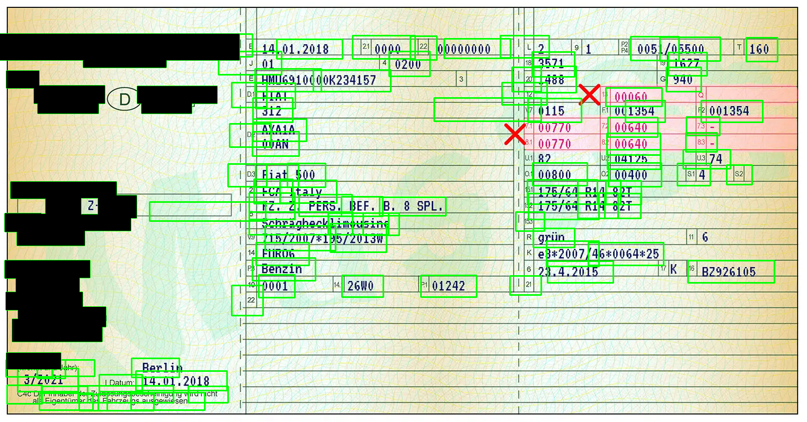

# Fahrzeugschein-detector
Blackens the text around "Name" & "Anschrift" in a "Zulassungsbescheinigung 1".
Utilizes _East-Text-Detector_ for text box detection and _tesseract_ for ocr.

## Installation:
TODO requirements.py
### howto install tesseract:
https://stackoverflow.com/questions/50951955/pytesseract-tesseractnotfound-error-tesseract-is-not-installed-or-its-not-i
### Install german language pack
apt-get install tesseract-ocr-deu
